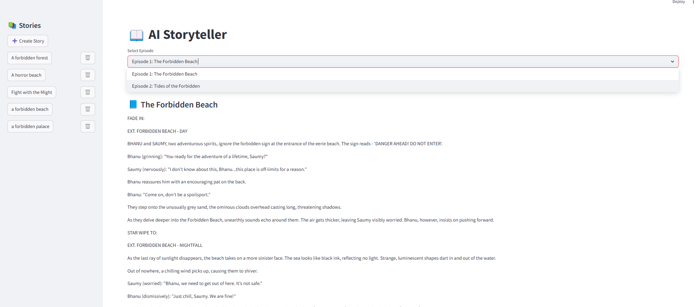
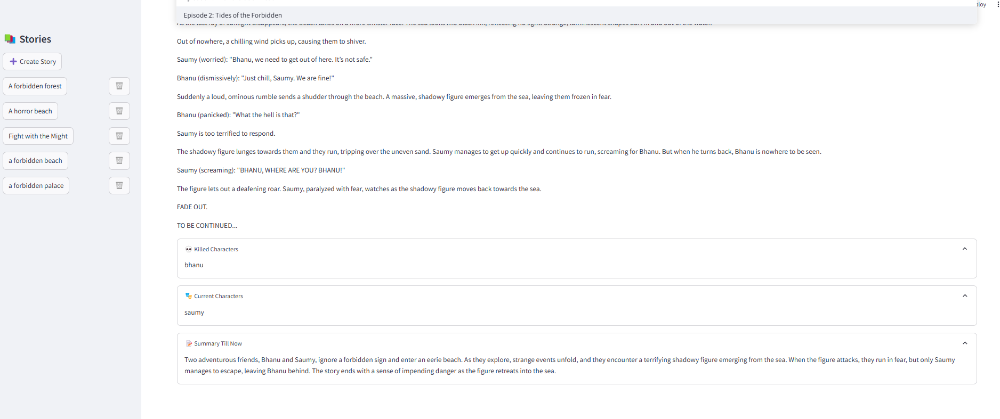

# 🧙‍♂️ AI Storyteller - Streamlit App

Create rich, multi-episode stories powered by GPT-4 with consistent characters, evolving arcs, summaries, and episodic structure — all through a simple Streamlit UI.


## Features

-  **Multi-Episode Story Generation**  
  Generate long-form stories with a user-defined number of episodes.



-  **Character Consistency**  
  Provide initial characters — they are **guaranteed to appear in Episode 1** and tracked throughout the story. Characters can be killed and removed from future episodes.


- **Customizable Story Settings**
  - Tone (e.g., Comedic, Dark, Romantic)
  - Tropes (e.g., Enemies to Lovers, Hero's Journey)
  - Style (e.g., First Person, Third Person)


- **Smart Summarization**  
  Each episode is summarized with a GPT-powered summarizer to preserve context for future episodes.



-  **Cliffhangers & Continuity**
  Every episode ends with a cliffhanger and logically continues the storyline with previous character knowledge.

- **Validation-Ready Output**  
  All generated episode data is returned as **strictly valid JSON** with:
  - `title`
  - `body`
  - `killed_characters`
  - `current_characters`

## Technical Stack

- **Frontend:** Streamlit (for interactive UI)
- **LLM:** OpenAI GPT-4 (story generation), GPT-3.5 (summarization)
- **Backend Logic:** Python (modular functions for story building, tracking characters, maintaining summaries)

##  Running the App

###  Prerequisites

- Python ≥ 3.8
- OpenAI API Key

###  Installation

1. **Clone the repo:**

   ```bash
   git clone https://github.com/saumy-sh/KuKu-FM.git
   cd KuKu-FM

2. **Set Up Virtual Environment (Recommended)**
    ```bash
    python -m venv venv
    source venv/bin/activate  # On Windows use: venv\Scripts\activate
    ```
3. **Install Dependencies**
    ```bash
    pip install -r requirements.txt
    ```

4. **Configure API Key**
- Create a new .env file in the project root.
- Add your key:
    ```bash
    OPENAI_API_KEY=your-api-key-here
    ```
5. **Launch the Application**
    ```bash
    streamlit run main.py
    ```

You can access the app at following link:
```bash
http://localhost:8501
```
To stop the app just press Ctrl+C


###  How It Works (Some more functions have been introduced will be updated later)
- The app collects user inputs: characters, trope, tone, number of episodes, etc.
- From backend we call `create_story()` function which passes the required arguments and generates outputs using `generate_episode()` and `summarize_with_openai()` functions.
- `generate_episode()` uses GPT-4 to create JSON-formatted episodes, tracking character presence and deaths.
- `summarize_with_openai()` condenses the story so far and feeds it into the next episode's context.
- Episodes are displayed in real-time on the Streamlit frontend.


###  TODO (Optional Enhancements)
- Add download/share options for story exports (PDF, TXT)
- Visual character timeline or arc tracking
- Add illustrations using DALL·E or SDXL
- Let users pick character personalities and goals

Made with ❤️ by Saumy Sharan, Bhanu Kumar and Aayush Patil.
